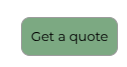
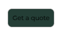
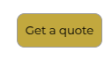
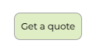
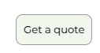

# Mark DMC

This is a web app which offer digital marketing services

## Tech Stack

- Next js
- Node js
- MongoDB
- Express js

```bash
git clone https://github.com/your-username/project-name.git
cd project-name
npm install
npm run dev
```

## Colors Specification

- Buttons  
  - Use sage-green as bg  
  
  - Use deep-green on hover
   

- Headings
  - Use mustard for Bold and Big headings
  

- Light Content
  - Use pale-green and soft-white for light content
  
    